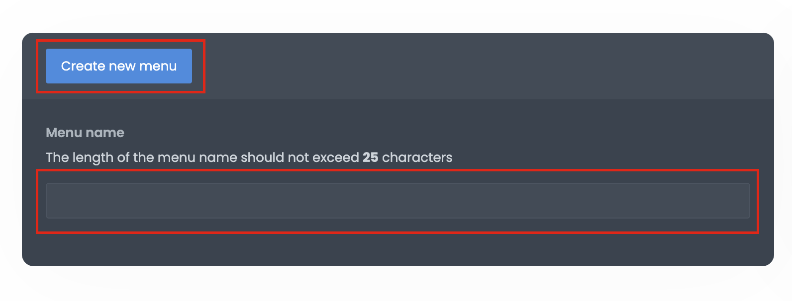
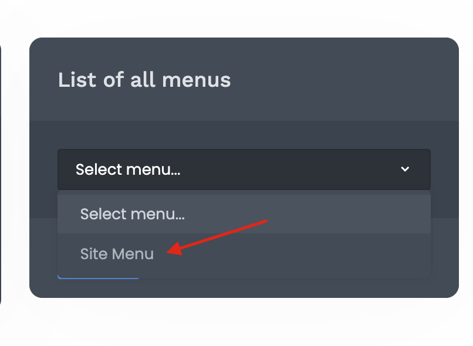
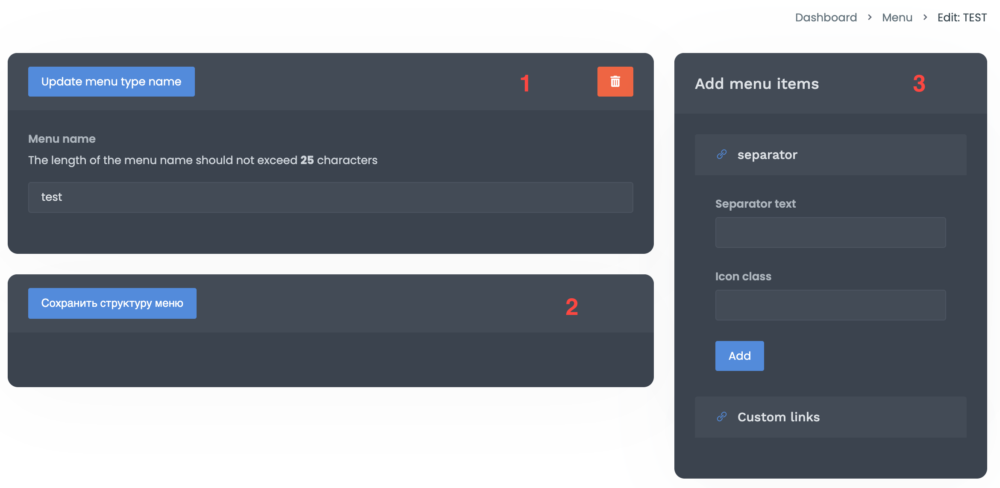

# Working with the menu for the site

## Menu creation

To create a menu for your site use the section **"Menu"** in the admin panel.

First, you need to create a new type of menu. Its name will be an alias for further rendering in views. Please note that the name must be unique, otherwise you will receive a corresponding error.



In the future, if there is a need to edit your menu, you can select it from the list in the same section (**"Menu"**):



After you create a new menu, you you will be redirected to the page for editing it:



Forms are presented here:

1. Form for editing the name of the menu type.
2. Form for creating the menu structure.
3. Form for creating menu elements.

To begin with, you need to enter data for the element in the form for creating menu items (form **3**). There are two sections for you, these are:

- separator. For example, to split one list.
- custom links. This is where you create an element with your link.

## Rendering a menu on a page

The system supports both the display of a custom menu and contains support for various popular frameworks.

To display:

1. In the template where your menu will be displayed:

```php
{{ Menu::render('site-menu', 'bs4') }}
```

The first parameter is the alias for your menu type. The second parameter is which rendering framework you want to use:

- `bs4`: [Bootstrap 4](https://getbootstrap.com/)
- `materialize`: [Materialize CSS](https://materializecss.com/getting-started.html)

If you want to display your template for menu rendering, then you need to specify the template name without the `.blade.php` extension. For example, the output of a custom template:

```php
{{ Menu::render('site-menu', 'custom-menu') }}
```

Note that calling render will generate the menu as a list. That is, to call, for example, BS4 menu, you need to render in the `<nav` block:

```html
<nav class="navbar navbar-expand-sm bg-dark navbar-dark">
    {{ Menu::render('site-menu', 'bs4') }}
</nav>
```

Note that the default framework templates are rendered. If you want to expand their capabilities, then it is better to create a custom template.

## Creating a custom menu template

All menu templates are stored in the **Admin/Menus** module, **UI/Views/components/menus** directory. Create a template file in it, enter the necessary data and display it on your page by calling:

```php
{{ Menu::render('site-menu', 'custom-menu') }}
```

You need to operate on the `$menu` variable, which contains the structure tree:

- `id` - menu element id
- `type_id` - menu type id
- `parent_id` - parent menu element id
- `position` - sort position of menu elements
- `name` - menu element name
- `alias` - menu element alias
- `route` - link
- `icon` - menu element icon
- `is_separator` - is the element a separator
- `sub` - an array of menu subcategories elements

Example of a custom menu:

```php
@php/** @var \App\Containers\Admin\Menus\Data\Objects\CmsMenuObject $link */ @endphp
<ul>
    @foreach($menu as $link)

        @if($link->is_separator)
            <li class="menu-title">
                {{ $link->name }}
            </li>
            @continue
        @endif

        <li class="@if(count($link->sub)) {{'drop-down'}} @endif">
            <a href="{{ $link->route }}">
                @if($link->icon)
                    <i class="{{ $link->icon }}"></i>
                @endif
                {{ $link->name }}
            </a>
            @if(count($link->sub))
                @include('menus::components.menus.' . $view, [
                    'menu'  => $link->sub,
                ])
            @endif
        </li>
    @endforeach
</ul>
```

Our menu is stored in the `$menu` variable, which we iterate over. Also, pay attention to the variable `$view` - it contains an alias for the type of our custom menu.

In order to determine that we have a drop-down menu with sub elements, we check:

```php
if(count($link->sub)
```

And if they exist, we recursively render the sub elements.

## Admin panel menu

The admin panel menu is configured through the config of the `Menu` module. You need the index of the array `"cms"`:

**Admin/Menus/Configs/menus.php**

```php
'cms' => [
    'dashboard' => [
        'is_separator'  => false,
        'name'          => 'menus::admin-menu.dashboard',
        'route'         => 'dashboard',
        'icon'          => 'la la-dashboard',
    ],

...

    'users' => [
        'is_separator'  => false,
        'name'          => 'menus::admin-menu.users',
        'route'         => 'javascript: void(0);',
        'icon'          => 'la la-user-secret',
        'child' => [
            'employees' => [
                'is_separator'  => false,
                'name'          => 'menus::admin-menu.employees',
                'route'         => 'employees',
                'icon'          => null,
            ],
            'roles' => [
                'is_separator'  => false,
                'name'          => 'menus::admin-menu.roles',
                'route'         => 'roles',
                'icon'          => null,
            ],
        ],
```

Parameters:

- `is_separator`: whether the element is a separator, if not specified, then the default is `false`.
- `name`: separator name.
- `route`: route of the element, if not specified, then the default is `'javascript:void(0);'`.
- `icon`: element icon.
- `child`: if the element has child sub elements. By default, an empty array.

After making changes to the menu structure for the admin panel, be sure to clear the cache:

```bash
php artisan config:cache
```